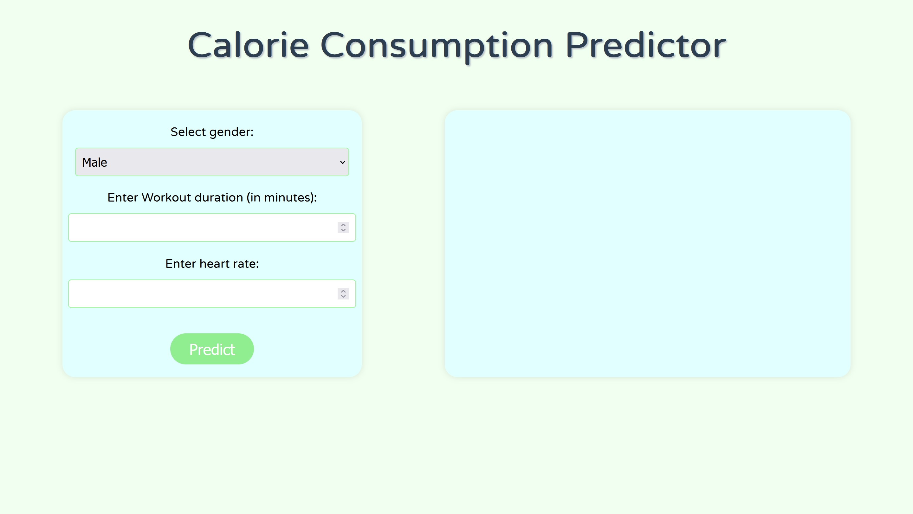

# CaloriePrediction
An ML project which can be used to predict the number of calories consumed based on workout duration and heart rate.

## Usage

1. Clone the repository to your local machine:
   
```$ git clone https://github.com/your-username/calorie-prediction.git ```


2. Run the `calorieui.py` file using your preferred IDE or by executing the following command in your terminal:
   ```python calorieui.py```
   
4. Once the application is running, open your web browser and go to [http://localhost:5000](http://localhost:5000).

5. The web page will display the following UI:
   

6. Fill in the gender, workout duration and heart rate values and click the "Predict" button.

7. The predicted number of calories consumed will be displayed on the screen.

## License

This project is licensed under the MIT License. See the [LICENSE](LICENSE) file for more details.

## Acknowledgments

- The dataset used for training the model: [Correlations between calories burnt, exercise and body type](https://www.kaggle.com/datasets/fmendes/fmendesdat263xdemos?select=exercise.csv).
